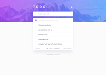

# Frontend Mentor - Todo app solution

This is a solution to the [Todo app challenge on Frontend Mentor](https://www.frontendmentor.io/challenges/todo-app-Su1_KokOW). Frontend Mentor challenges help you improve your coding skills by building realistic projects.

The live site can be accessed here: [https://remix-frontend-mentor-todo-app.netlify.app](https://remix-frontend-mentor-todo-app.netlify.app)

> **Warning**
> This showcase app has an actual online database where the created todos are saved

## Table of contents

- [Setup](#setup)
  - [Environment variables](#environment-variables)
  - [Netlify Setup](#netlify-setup)
  - [Development](#development)
  - [Deployment](#deployment)
- [Overview](#overview)
  - [The challenge](#the-challenge)
  - [Screenshot](#screenshot)
  - [Links](#links)
- [My process](#my-process)
  - [Built with](#built-with)
  - [What I learned](#what-i-learned)
  - [Continued development](#continued-development)
- [Useful resources](#useful-resources)

## Setup

### Environment variables

Create a file called `.env` with the following content and replacing with your own environment.

```
DATABASE_URL="[Replace with MongoDB connection string]"
SESSION_SECRET="[Replace with password used to encrypt the session cookie]"
```

### Netlify Setup

1. Install the [Netlify CLI](https://www.netlify.com/products/dev/):

```sh
npm i -g netlify-cli
```

If you have previously installed the Netlify CLI, you should update it to the latest version:

```sh
npm i -g netlify-cli@latest
```

2. Sign up and log in to Netlify:

```sh
netlify login
```

3. Create a new site:

```sh
netlify init
```

### Development

The Netlify CLI starts your app in development mode, rebuilding assets on file changes.

```sh
npm run dev
```

Open up [http://localhost:3000](http://localhost:3000), and you should be ready to go!

### Deployment

There are two ways to deploy your app to Netlify, you can either link your app to your git repo and have it auto deploy changes to Netlify, or you can deploy your app manually. If you've followed the setup instructions already, all you need to do is run this:

```sh
npm run build
# preview deployment
netlify deploy

# production deployment
netlify deploy --prod
```

## Overview

### The challenge

Users should be able to:

- View the optimal layout for the app depending on their device's screen size
- See hover states for all interactive elements on the page
- Add new todos to the list
- Mark todos as complete
- Delete todos from the list
- Filter by all/active/complete todos
- Clear all completed todos
- Toggle light and dark mode
- **Bonus**: Drag and drop to reorder items on the list
- **Bonus**: Build this project as a full-stack application

### Screenshots

#### Light theme

| Mobile layout                                                                                   | Desktop layout                                                                                    |
| ----------------------------------------------------------------------------------------------- | ------------------------------------------------------------------------------------------------- |
| <a href="./screenshots/mobile-light.png"></a> | <a href="./screenshots/desktop-light.png"></a> |

#### Dark theme

| Mobile layout                                                                                 | Desktop layout                                                                                  |
| --------------------------------------------------------------------------------------------- | ----------------------------------------------------------------------------------------------- |
| <a href="./screenshots/mobile-dark.png"></a> | <a href="./screenshots/desktop-dark.png"></a> |

### Links

- Live Site URL: [https://remix-frontend-mentor-todo-app.netlify.app](https://remix-frontend-mentor-todo-app.netlify.app)

## My process

### Built with

- Semantic HTML5 markup
- CSS custom properties
- Flexbox
- Mobile-first workflow
- [React](https://reactjs.org/) - JS library
- [Remix](https://remix.run/) - React framework
- [react-beautiful-dnd](https://github.com/atlassian/react-beautiful-dnd) - Drag and drop library for React
- [Prisma](https://www.prisma.io/) - Database ORM
- [MongoDB](https://www.mongodb.com) - NoSQL document database

### What I learned

To build this app, I used two technologies I had no prior experience with, Remix and Prisma. Having completed it, I feel like I got a good understanding of their fundamentals.

In this section I will comment on some challenges I've encountered while building this app.

#### Visitor session

Since I wanted to complete the bonus challenge "Build this project as a full-stack application", the app needed to have some sort of authentication process. I solved this by implementing a mechanism where when a user opens the app for the first time, they are automatically signed in with a visitor session (which lasts for 24 hours) and can start using it right away.

#### Optimistic UI with Remix

My process to implement Optimistic UI was to delay every request by 3 seconds on the server and make the changes on the UI side.

Since you can have multiple todos being created, updated or deleted, todos being reordered, the user changing the filter or clearing completed todos. After some failed attempts I think I reached a good solution. Centralizing the changes by creating a copy of list of todos and them applying each ongoing request to it, made it a lot more predictable and easier to implement changes.

### Useful resources

- [Remix's Documentation page](https://remix.run/docs/en/v1) - Most of my learning on Remix was by reading the documentation.
- [Remix's GitHub repo](https://github.com/remix-run/remix) - The source code, multiple examples, discussions and issues were a great source of information.
- [Remix's Youtube channel](https://www.youtube.com/c/Remix-Run) - The "Remix Single" series by Ryan Florence is a must watch for anyone trying to learn Remix.
- [Prisma's Documentation](https://www.prisma.io/docs/) - From learning to build a scheme to making nested writes and transactions, the Prisma's documentation was a good source of learning material.
- [Hacker News' discussion on maintaining user-defined order in a database](https://news.ycombinator.com/item?id=25797674)
